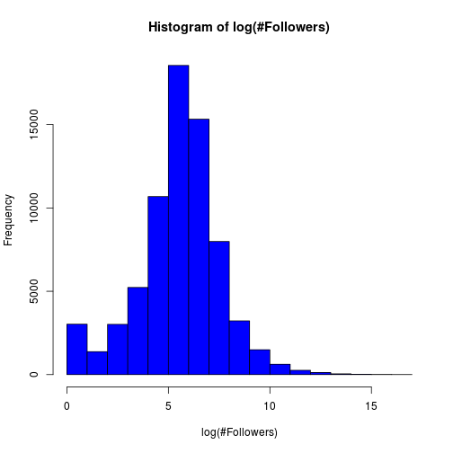
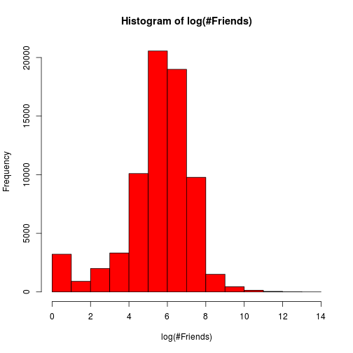
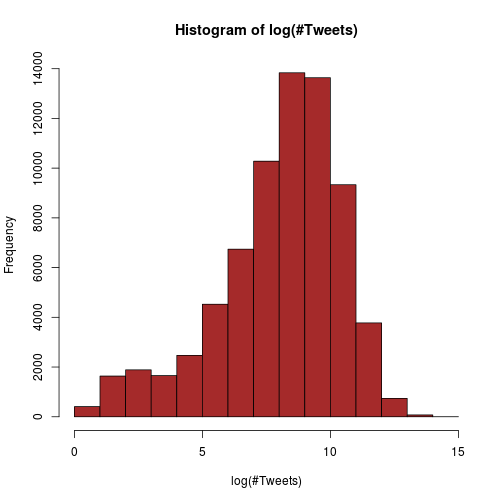
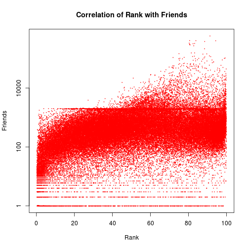
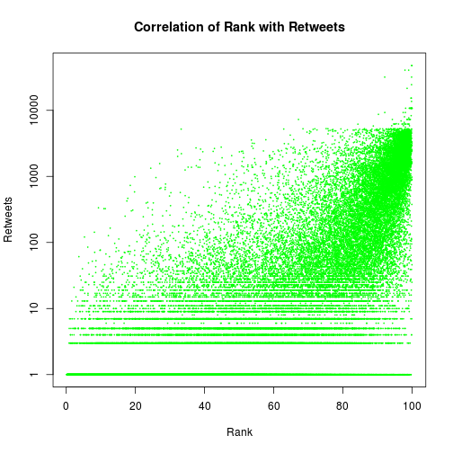

# MarketIQ Data Analysis Exercise #
This R script ranks Twitter users on a scale of 0-100 based on these metrics provided in the data.
* Number of followers: Users who follow the Twitter handle.
* Number of friends: Number of users the Twitter handle follows.
* Tweets: Total number of tweets ever tweeted.
* Number of Retweets: Total number of combined retweets for all tweets coming from the handle.

## Introduction ##
The most popular way of ranking twitter users is to use a PageRank algorithm on the users' social network graph. 
However for that we need additional data like which users follows a particular user and which retweets relate to a particular tweet.
Since we do not have that data, we will start with very basic assumptions about the Twitter social network.
* Many followers should correlate to higher rank. 
* Many friends may not always imply high rank. Because many friends with few followers may indicate a spammer 
  which means lower rank.
* Many retweets is a very strong indicator of popularity. So it should imply higher rank.
* Many tweets may also imply higher rank but many tweets with few retweets may also indicate a spammer.

With these assumptions, lets dive into our data analysis.
## Initialization ##
Initialize random seed and load the given csv file into a data frame.


```r
set.seed(123)
twitter_users <- read.csv("TwitterUsers.csv", stringsAsFactors = FALSE)
```

It makes sense to filter out users who have no followers or zero tweets to remove bots.
But since it did not change the analysis in the end, we decided to preserve them.
## Distributon Analysis ##
Lets look at the distibution of followers count.


```r
table(cut(twitter_users$Number.of.followers, breaks = 10, labels = FALSE))
```

```
## 
##     1     2     3     4     5     6     9    10 
## 70982    16     3     6     3     1     1     1
```

As can be seen the distribution is very skewed because many people have few followers and 
few people have many followers. This is expected but now we will need to do log transformation
to fix this skew. Here is a plot of the resulting distribution. Note that we add 1 before taking the log
so that the zeros do not blow up our calculation.


```r
hist(log(twitter_users$Number.of.followers + 1), col = "blue", 
     main = "Histogram of log(#Followers)", xlab = "log(#Followers)")
```

 

This is the familiar Gaussian distribution which simplifies our analysis.
The same skew is present in the other metrics as well so we do the same log transformation to other metrics 
and verify that the resulting distributions are also Gaussian.


```r
hist(log(twitter_users$Number.of.friends + 1), col = "red", 
     main = "Histogram of log(#Friends)", xlab = "log(#Friends)")
```

 

```r
hist(log(twitter_users$Tweets + 1), col = "brown", 
     main = "Histogram of log(#Tweets)", xlab = "log(#Tweets)")
```

 

## Outline of Formula ##
Now that we have a bunch of nice Gaussians, here's the outline of our formula to rank users.
* First we will transform all metrics to their natural logs (after adding 1 so that zeros do not create problems)
* Then we will scale all log metrics to their z-scores. z_score = (x - mean) / sd. This ensures that for all
  metrics the mean is zero and the standard deviation is 1 which is the standard normal distribution.
* Then we will calculate a rank metric which will be a linear weighted combination of all scaled log metrics.
  Note that a linear combination of a Gaussian is also a Gaussian. We will also scale this metric so that it also
  follows a standard normal distribution with mean 0 and sd 1.
* Finally we will calculate a percentile value of the rank that is in the range 1..100. This will be our final rank.

## Global Population Statistics ##
First things first: Lets calculate the averages and standard deviations of all log metrics.


```r
log_mean_followers <- mean(log(twitter_users$Number.of.followers + 1))
log_sd_followers <- sd(log(twitter_users$Number.of.followers + 1))

log_mean_friends <- mean(log(twitter_users$Number.of.friends + 1))
log_sd_friends <- sd(log(twitter_users$Number.of.friends + 1))

log_mean_tweets <- mean(log(twitter_users$Tweets + 1))
log_sd_tweets <- sd(log(twitter_users$Tweets + 1))

log_mean_retweets <- mean(log(twitter_users$Number.of.retweets + 1))
log_sd_retweets <- sd(log(twitter_users$Number.of.retweets + 1))
```

## Rank Function ##
This is the rank function described above.
This function takes the number of followers, friends, tweets and retweets of a user (raw count NOT log)
along with a weight vector and returns a rank in the range 0...100 based on the above formula


```r
rank_twitter_user <- function(followers = 0, friends = 0, 
                              tweets = 0, retweets = 0, 
                              weights = c(followers = 1, friends = 1, tweets = 1, retweets = 1)) {
  # this function simply calculates the z score after converting to log scale.
  log_z_score <- function(metric, log_mean = 0, log_sd = 1) {
    return((log(metric + 1) - log_mean) / log_sd)
  }
  
  followers <- log_z_score(followers, log_mean_followers, log_sd_followers)
  friends <- log_z_score(friends, log_mean_friends, log_sd_friends)
  tweets <- log_z_score(tweets, log_mean_tweets, log_sd_tweets)
  retweets <- log_z_score(retweets, log_mean_retweets, log_sd_retweets)
  
  # rank is a linear weighted combination of other gaussians.
  # we normalize it by dividing it with root-sum-squared weights
  rank <- (weights["followers"] * followers + 
             weights["friends"] * friends + 
             weights["tweets"] * tweets +
             weights["retweets"] * retweets) / sqrt(sum(weights ^ 2))
  # pnorm function calculates the percentile of normal distribution
  # pnorm is in range 0..1 so we multiply by 100.
  return(100 * pnorm(rank)) 
}
```

## Evaluation ##
Notice that the default weight vector is all 1s. we did not hard code the weights but instead they are passed as parameters. 
This makes the equation customizable. e.g. Lets try these weights


```r
weights <- c(followers = 1.5, friends = -0.5, tweets = 1, retweets = 2)
```

This corresponds to the equation:

`rank = 1.5 * followers - 0.5 * friends + 1 * tweets + 2 * retweets`

All variables on the right hand side are scaled logarithmic. Basically it means we are giving the highest weight to retweets
and negative weight to friends (see the initial assumptions for why this is so).
Lets calculate the rank of all the users in the data frame.


```r
twitter_users$rank <- rank_twitter_user(followers = twitter_users$Number.of.followers,
                                        friends = twitter_users$Number.of.friends,
                                        tweets = twitter_users$Tweets,
                                        retweets = twitter_users$Number.of.retweets,
                                        weights = weights)
```

Top users with respect to their ranks.


```r
head(twitter_users[order(-twitter_users$rank), ])
```

```
##           username Number.of.followers Number.of.friends Tweets
## 83        zeekay15              426204               715  77642
## 764 itsTheKatyCats               34152               150  77249
## 460   gagatooturnt               60307               346  45757
## 81       nicekicks              436206               889  95205
## 2              NBA            10470525              1230  76118
## 426  OfficialFOXES               67433                85  11410
##     Number.of.retweets     rank
## 83                2454 99.99690
## 764              10756 99.99517
## 460              10766 99.99492
## 81                 975 99.99165
## 2                   45 99.98910
## 426               3192 99.97760
```

It would be interesting to look at a few plots to see how the rank varies with different metrics.


```r
plot(twitter_users$rank, twitter_users$Number.of.followers + 1, log = "y", cex = .1, col = "blue", 
     xlab = "Rank", ylab = "Followers", main = "Correlation of Rank with Followers")
```

 

```r
plot(twitter_users$rank, twitter_users$Number.of.friends + 1, log = "y", cex = .1, col = "red", 
     xlab = "Rank", ylab = "Friends", main = "Correlation of Rank with Friends")
```

 

```r
plot(twitter_users$rank, twitter_users$Tweets + 1, log = "y", cex = .1, col = "brown",
     xlab = "Rank", ylab = "Tweets", main = "Correlation of Rank with Tweets")
```

 

```r
plot(twitter_users$rank, twitter_users$Number.of.retweets + 1, log = "y", cex = .1, col = "green", 
     xlab = "Rank", ylab = "Retweets", main = "Correlation of Rank with Retweets")
```

 

The plots show that the rank varies with a positive correlation with all metrics. If needed the weights can be tweaked
to give more importance to a particular metric. 
